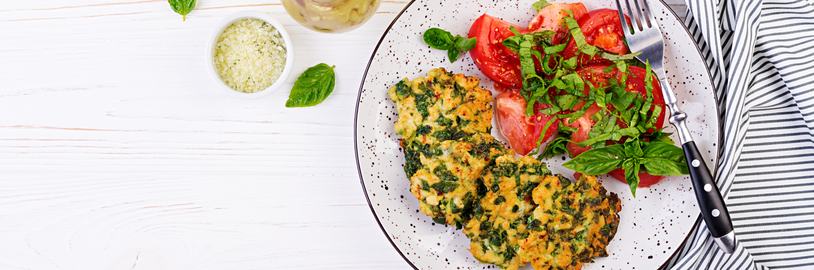

# 🍽️ Escale Française – Restaurant Website

Un site vitrine responsive pour un restaurant gastronomique moderne, construit avec **HTML5**, **CSS3**, et **Bootstrap 5**.

---

## 🔍 Aperçu

Le projet présente un restaurant fictif nommé *Escale Française* et met en avant son menu, son histoire et un formulaire de contact.

 <!-- Remplacer par une capture réelle si nécessaire -->

---

## 🛠️ Technologies utilisées

- **HTML5**
- **CSS3**
- **Bootstrap 5**
- **Google Fonts (Crimson Text)**
- **Boxicons**

---

## 📁 Structure du projet

 /
├── Assets/
│ └── images/
│ ├── escale-francaise-logo.png
│ ├── escale-francaise-logo-white.png
│ ├── main-image2.png
│ ├── Confit-de-Canard.jpg
│ ├── Fajita-au-poulet.jpg
│ └── La-quiche-lorraine.jpg
├── index.html
└── style.css 


---

## 🧩 Fonctionnalités

### ✅ Navbar (Bootstrap)
- Logo à gauche
- Liens de navigation (Accueil, Menu, À propos, Contact)
- Responsive avec bouton hamburger

### ✅ Section Hero
- Image de fond avec overlay sombre
- Slogan : *"Savourez l'excellence dans chaque bouchée"*
- Bouton d’appel à l’action

### ✅ Section Menu
- Présentation de 3 plats avec :
  - Image
  - Description
  - Prix stylisé

### ✅ À propos de nous
- Image à gauche, texte à droite (ou inversement sur mobile)
- Présentation rapide du concept du restaurant

### ✅ Formulaire de contact
- Champs : Nom, Email, Message
- Bouton "Envoyer" stylisé

### ✅ Footer
- Copyright
- Rappel du nom du restaurant

---

## 🎨 Personnalisation CSS

Les classes principales :
- `.hero-title`, `.cos-title` → Police **Crimson Text**, différentes tailles responsives
- `.btn-outline-warning`, `.btn-warning` → Boutons personnalisés en **doré**
- `.display-12`, `.display-15` → Sizing texte
- `.bord` → Bordure dorée pour les inputs

---

## 📱 Responsive design

- Adaptation mobile pour :
  - Hero section
  - Taille des titres & boutons
  - Navbar (collapse)

---

## ⚙️ Installation locale

```bash
git clone https://github.com/votre-utilisateur/escale-francaise.git
cd escale-francaise
# puis ouvrez index.html dans votre navigateur
 
